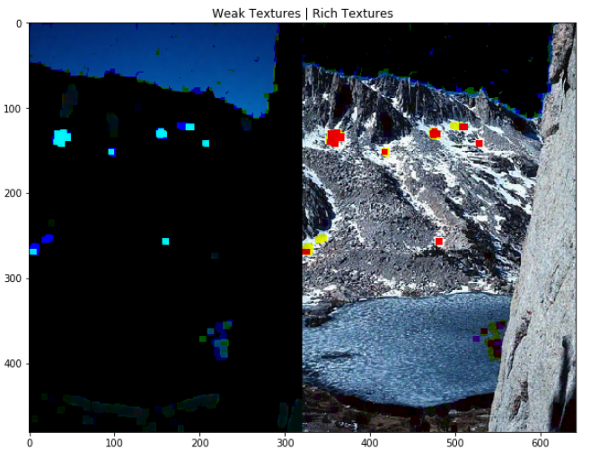

# Image denoising using weak texture patches and genetic algorithms

## Sam Drugan

## 115463962

### **Final Year Project - BSc in Computer Science**

### Univeristy College Cork

### Department Of Computer Science

#### April 2019

##### Supervisor: John Mullane

$$\pagebreak$$

## Contents

1. Introduction
   1. Motivation
      1. Image Noise
      2. Evolutionary Algorithms (EA)
      3. Weak Texture Patches
   2. Goals
   3. Project Overview
   4. Achievements
2. Analysis
   1. Image Processing
      1. Images In Computers
      2. Image Noise/Denoising
         1. Median Filter
         2. Gaussian Filter
         3. Chambolle's Total Variation Filter 
         4. Weiner Filter
      3. Weak Texture Patches
   2. Evolutionary Algorithms (EA)
      1. Individual & Population
      2. Evaluation & Fitness
      3. Selection, Crossover and Mutating
   3. Evaluation Metrics
     1. Root Mean Squared Error (RMSE)
     2. Peak Signal To Noise Ratio (PSNR)
     3. Image Quality Index (IQI)
     4. Structural Similarity Index Metric (SSIM)
3. Design
    1. Design Overview
    2. Image Dataset
    3. The Evaluate Function
      1 Individual Decoding
      1. Denoising the image
      2. Fitness
    4. Final EA components (Selection, Crossover & Mutation)
4. Implementation
   1. Technologies Used
      1. Pyhton Libraries
      2. DEAP
      3. Jupyter Notebook
   2. Images
   3. Weak Texture Patches
   4. Evaluation Function
      1. Individual Decoding and Action Mapping
      2. Applying Denoising Filters
   5. Evolutionary Algorithm
   6. Displaying Results
5. Evaluation
   1. Evaluation Overview
   2. Function Assessment
   3. Testing Results
   4. Problems
   5. Use Cases/Viability
6. Conclusions


$$\pagebreak$$

## Abstract


### Image denoising using weak texture patches and genetic algorithms

#### Sam Drugan

Image denoising is an important process in the fields of computer vision and digital cameras. In this project we explore how applying denoising filters, such as Chambolle’s total vision denoising algorithm and Gaussian blur, to the weak and rich textured area of an image can improve denoising. We use a genetic algorithm to select the filter and parameters that are used for each patch. Using the gradient of each patch in the image and its statistics, we generate the weak texture patches. This gives us a mask of the weak textured areas which we can use to extract the specific pixels needed using matrix multiplication. We can then combine the weak and rich texture patches, after applying the filter, to give us the complete denoised image. The evaluation methods we use are the root mean squared error, peak signal-to-noise ratio, image quality index, and structural similarity index. We tested the model on an image that had a layer of additive white Gaussian noise added. Early results show an improvement in each the previous scores when a different filter is applied to each type of patch over using a single filter on the whole image based on the estimated noise level. This could prove effective when trying to select an optimal filter to use or when trying to optimize the denoising as far as possible.


$$\pagebreak$$

## Declaration

### Declaration of Originality

In signing this declaration, you are conforming, in writing, that the submitted  work  is  entirely  your  own  original  work,  except  where  clearly  attributed otherwise, and that it has not been submitted partly or wholly for any other educational award. 

I hereby declare that:

- this is all my own work,  unless clearly indicated otherwise,  with fulland proper accreditation;
- with respect to my own work: none of it has been submitted at any ed-ucational institution contributing in any way to an educational award;
- with  respect  to  another’s  work:   all  text,  diagrams,  code,  or  ideas,whether verbatim, paraphrased or otherwise modified or adapted, havebeen  duly  attributed  to  the  source  in  a  scholarly  manner,  whetherfrom books, papers, lecture notes or any other student’s work, whetherpublished or unpublished, electronically or in print
  
Signed: 

Date: 

$$\pagebreak$$


## Acknowledgements

Firstly, I would like to thank Dr. John Mullane for his help and guidence in this project. I am especially thankful for the opportunity to learn about this field of computer science. It has given me a big appreciation for the areas of image processing, genetic algorithms, and linear algebra.

I'm very thankful to my family for always being here for me and supporting me throughout my whole life. Especially my parents who have always done everything they can to ensure that I am happy. They have always motivated me to work harder and to appreciate what I'm doing.

Finally, I would also like to thank my friends who have the whole process more enjoyable. In many ways they have inspired me to keep challenging myself and improve in any area I can. I'm also thankful to everyone in Netsoc who have mativated me through the work they do in and out of the society.


$$\pagebreak$$


## List of Figures


$$\pagebreak$$

## Chapter 1

## Introduction

### 1.1 Motivation

#### 1.1.1 Image Noise

Noise is present in an image when there is a random variance in its pixel values. Image denoising is an important step in any image processing application. Fields such as computer vision rely on having high-quality images in order to work as efficiently as possible. Rafati, Mehravar, et al.[1] have shown how sensitive such systems can be to even low levels of noise. Digital cameras are also required to output images that closely represent the real world. It is therefore essential that as much of the process of this is as efficient as possible. The presence of noise in an image can cause problems for both perceived quality and effectiveness of algorithms using the image. 

#### 1.1.2 Evolutionary Algorithm (EA)

One problem with using denoising filters is the fact that input parameters are required to be selected manually. For example, a Gaussian filter requires an estimated noise level and Chambolles total variation filter requires a weight parameter[2]. Since there are many of these filters, it can take a long time to find the optimal one to use. The idea is to use an evolutionary algorithm to automatically select the filter and parameter(s).

#### 1.1.3 Weak Texture Patches

Another problem faced in denoising images is the presence of naturally noisy areas. One example of this is a beach where the sand is naturally noisy but the sky is smooth. Many images with these areas lose much of their detail when a single filter is applied over the image. Dealing with rich/weak textured areas separately and then combining the results of the two could help address this issue.


*Fig a. Image containing a mixture of weak textures(eg. the sky) and rich textures/naturally noisy areas(eg. the grass)*

### 1.2 Goals

The main goal of this project is to explore the effectiveness of automatically selecting a denoising filter and parameter. A secondary aim is to see if applying the filter separately to the weak and rich texture patches will have an effect on the outcome. The root mean squared error(RMSE)[3], peak signal to noise ratio(PSNR)[3], image quality index(IQI)[4] and structural similarity index metric(SSIM)[5] are used to evaluate the selected filters. The student aims to achieve better metrics then applying a single filter over the entire image. As a side goal, the student aims to learn more in the fields of image processing, linear algebra, and evolutionary algorithms.

### 1.3 Project Overview

Initially, the project takes in an image and applies a layer of additive white Gaussian noise to it. It then generates a mask covering the noisy images weak texture patches. The evolutionary algorithm creates a population of individuals which represent the filters to apply to the weak/rich texture patches. From here, the selected filter for each texture type is applied over a copy of the whole image and it uses the mask to take/remove the weak texture patch. The remaining patches in each denoised image are combined to give the complete denoised image. It then measures the effectiveness of the filter by calculating one of the above metrics, RMSE for example. After enough generations of individuals are tested, it then tests the individual on a different image with a similar level of estimated noise. 

### 1.4 Achievements

The student achieves the goal of beating other standard methods metrics in the denoising proccess although the reilst vary greatly. While the results are better in general for the RMSE, PSNR, and IQI, the students method of denoising falls short of performing better then just using a single filter in regards to the SSIM. This is true for medium to high noise levels which cause major visual problems with in an image. The method in this project performs the best in nine out of ten test cases when evaluated on images of low noise levels (although still visually noticeable).

$$\pagebreak$$

## Chapter 2

## Analysis

### 2.1 Image Processing

### 2.1.1 Images in Computers

There are many ways to represent images in memory. The standard way to represent natural pictures is as a raster image. A raster image is a rectangular matrix that can vary in depth. Each position in the matrix represents that locations colour/greyscale value. In this project, images are stored in a matrix with a depth of 3 with each channel representing red, blue, and green respectively. Each position in the matrix is called a pixel. This is an additive colour model as equal amounts of each will produce white.

### 2.1.2 Image Noise/Denoising

Since storage space limits the ability to store large images due to the increasing space required by higher resolutions, a number of steps are taken to compress the data. One step is to apply colour quantisation to the image to reduce the range of values being stored. Quantisation is the process of estimating a range of values into a discrete value. This can reduce the amount of data stored but retain the same visual quality. A problem with this is it adds errors in the values to the image known as noise. Depending on the level of quantisation, the noise can be more or less noticeable.

The main goal the student will work towards is to visually reduce the effects of noise automatically. Currently, a person looking to denoise an image manually will need to select the filter and parameters themselves. This can be a cumbersome process if they do not understand what is required. Situations like this lead to a lot of trial and error which can be time-consuming. The student hopes to achieve scores in various quality measures that are better than applying simple filters.

This project will focus on additive white Gaussian noise. The main source of this type of noise is during the aquisition stage of the image due to faults in the sensor e.g. the sensors temperature is too high. A standard model for this type of noise is $X = Y + N$ where $X$ is the noisy image, $Y$ is the pure image and $N$ is the layer of additive white Gaussian noise. There a various methods already available to reduce this type of noise. Listed here are a few filter types:

#### 2.1.2.1 Median Filter

Assigns the median value to the pixel of it and its neighbours. It requires no input parameters to work. [4]

#### 2.1.2.2 Gaussian Filter

A Gaussian filter blurs an image causing a reduction in noise and detail. This is achieved by convolving the image using a Gaussian function. The standard deviation of the noise is required.

#### 2.1.2.3 Chambolle's Total Variation Filter 

Attempts to reduce the total variance in the image based on a given weight parameter.[2] A higher weight reduces noise further but also reduces the level of detail.

#### 2.1.2.4 Weiner Filter

Estimates the desired target image by applying a linear time-invarient filter to the signal. Similar to the Gaussian filter, it requires a noise level estimation.[4]

### 2.1.3 Weak Texture Patches

A weakly textured patch in an image is found where a cluster of pixels contains similar values to each other. Examples of this in natural images would be a wall or a clear sky. These patches are useful in noise estimation as it is easy to detect a disturbance. The main issue with this is the difficulty of detecting weak texture patches in noisy images as the noise variance causes pixel values to vary more.

Liu, Xinhao, et al.[6] propose a method to estimate noise levels of additive white Gaussian noise by analysing weak texture patches in an image. They also show a method for generating a mask of the weak texture patches in an image. The method they propose analyses statistics from the gradient covariance matrix of each patch. The process looks for what is expected in a weak texture patch after a layer of noise has affected the image. It then estimates a threshold such that a patch is weakly textured if the maximum eigenvalue of its gradient covariance matrix falls below the threshold. This gives a matrix, with the same shape as the image, where there is a one at each position if that pixel is part of a weakly textured patch. The rest of the matrix contains zeros indicating the pixels that are part of richly textured patches. 


*Fig b.[6] Three examples of patches of different types. $s_2^1$ signifies the maximum eigenvalue of the gradient covarience matrix of each patch type*

### 2.2 Evolutionary Algorithms (EA)

Evolutionary algorithms(EA) attempt to mimic the process of natural evolution. Distinct components work together to emulate this process in some manner. At the most basic level, an EA will maintain a population of individuals, evaluate the effectiveness of each individual using a fitness function, and create the population of the next generation. It repeats this step for a number of generations until an optimal solution is found. After the final generation, the EA will return the overall best-performing individual as a solution. This solution is optimized to the given fitness function. It is ideal when finding solutions to problems without making assumptions about the optimal result. In particular, it is useful in this project as it allows someon to search for an optimal pair of denoising filters to use on each of the texture patch types. It also allows for easy and rapid expansion of the filters/parameter combinations being used. Below is a more detailed summary of the elements in an EA:

#### 2.2.1 Individual & Population

An individual in an EA is usually represented as a bit string. The position of a sequence of bits in the string is used to represent what action to take depending on the situation. A population is the set of individuals used for any given generation.

#### 2.2.2 Evaluation & Fitness

The evaluation step takes each individual in the population and returns a fitness value. This step will vary the most between different uses. In the case of this project, it will measure the effectiveness of the denoising filter.

#### 2.2.3 Selection, Crossover & Mutating

There are a number of different techniques for the selection of individuals that are used to create a population for the next generation. One example of a selection function that this project uses is tournament selection. Tournament selection randomly takes a small group of individuals and returns the best performing amongst them. The crossover step pairs up the selected individuals and creates two new individuals. It creates the new individuals by applying a point crossover on the bits strings and returning the two possible results. Finally, there is a chance, decided by the user, for an individual in the next population to be mutated in some way. One common way to do this is to flip one bit in the bit string. The EA does this to prevent every individual from becoming the exact same and preventing further experimentation.

### 2.3 Evaluation Metrics

As shown above, there are four methods of evaluating the effectiveness of a denoising filter. The main reason for this is that the EA optimizes the result based on the fitness function. One of the above metrics will be used as the fitness function, and then use the others to analyse its effectiveness in other areas.

#### 2.3.1 Root Mean Squared Error (RMSE)

The mean squared error(MSE) gives the average difference between pixel values in the original image and the denoised image. The RMSE is the square root of this. 

$$ MSE = {1\over{MN}}{\sum^M_{i=1}}{\sum^N_{j=1}}(x(i,j) - y(i,j) )^2 $$

$$ RMSE = \sqrt{MSE}$$

where $x$ and $y$ are the original image and the denoised image and $M$ and $N$ are the dimensions of the images.

#### 2.3.2 Peak Signal To Noise Ratio (PSNR)

The PSNR is used as a quality measure when evaluating images. It represents the ratio between the average difference in pixel values and the maximum possible signal. It is particularly useful due to its low complexity which suits its use as a fitness function.

$$PSNR = 10\log_{10}{{(2^n - 1)^2}\over{\sqrt{MSE}}}$$

where $n$ is the number of bits to represent each pixel. For greyscale images this value is 8 while for full colour 24 bits are required.

#### 2.3.3 Image Quality Index (IQI)

IQI is another metric for image quality based on the degree of disturbance. It does this by analysing the loss of correlation, luminance distortion, and contrast distortion.

$$IQI = { 4*\sigma_{xy}*\bar{x}*\bar{y}\over{(\sigma^2_x + \sigma^2_y)*((\bar{x})^2 + (\bar{y})^2)} }$$

where

$$\bar x = {1\over N}\sum^N_{i=1} x_i$$

$$\bar y = {1\over N}\sum^N_{i=1} y_i$$

$$\sigma^2_x = {1 \over N - 1}\sum^N_{i=1}(x_i-\bar x)^2$$

$$\sigma^2_y = {1 \over N - 1} \sum^N_{i=1}(y_i-\bar y)^2$$

$$\sigma_{xy} = {1 \over N - 1} \sum^N_{i=1}(x_i-\bar x)(y_i-\bar y)$$

#### 2.3.4 Structural Similarity Index Metric SSIM

SSIM is another metric that returns a result based on the luminance, contrast, and structural difference between the two images. While other metrics such as RMSE are purely a mathematical measure, SSIM gives an idea of the perceived quality of the resulting image. A measure like this is useful in fields such as digital cameras where mathematical accuracy does not matter to the end user.[5] 

$$SSIM = {(2*\bar x * \bar y + C_1)(2*\sigma_{xy} + C_2) \over (\sigma^2_x + \sigma^2_y + C_2)*((\bar{x})^2 + (\bar{y})^2 + C_1)}$$

where

$$ C_1 = (k_1L)^2$$
$$ C_2 = (k_2L)^2$$
$$ L = (2^n - 1)$$

$k_1 = 0.01$ and $k_2 = 0.03$ by default.


$$\pagebreak$$


## Chapter 3

## Design

### 3.1 Design Overview

As shown in the previous section, the main design for this project is split across the various aspects required to build an EA. The bulk of the work will be in implementing the evaluate function. The student will use python and a number of supporting libraries in order to achieve this. Prior to the EA running, the image data set is generated.

### 3.2 Image Dataset

The image data set is held in a custom object. It will maintain a copy of the original image, the noisy image and the weak texture patch mask. Since the generation of the weak texture patch also estimates the noise level it stores this as well to use when evaluating the result. It also provides functionality to reload the data set and set the level of noise that is applied. 

### 3.3 The Evaluate Function

This step in the EA comprises 3 basic steps. Firstly, it takes the individual bit string and decodes it, mapping it to the actions required to be taken out. Next, the denoising filters are applied to copies of the noisy image. The texture patches are extracted using the mask that was previously generated. The extracted denoised images are then recombined to give the full image. Finally, the third step is to return a value as the fitness of the individual. This function will be one of the four evaluation functions outlined previously. Doing this allows for experimentation with optimizing the result to different evaluation metrics.

#### 3.3.1 Individual Decoding

In this case, the first half of the bit string will map to the denoising filter and parameters to use on the weak texture patches while the rest represents the filter to use on the rich texture patches. 

#### 3.3.2 Denoising the image

This step in the evaluation function is the most important as the effectiveness of the denoising filter is what gets measured in the final step. The filters selected by the individual are applied to separate copies of the image. The weak/rich texture patches are extracted using the previously generated mask. This can be achieved by the following: $DW = DI_1 * W$ where $W$ is the weak texture mask, $DI_1$ is the denoised image using the filter selected for the weak textures, and $DW$ is the denoised weak textures. Then, the denoised rich texture, $DR$, is obtained from the following: $DR = DI_2 - (DI_2 * W)$ where $DI_2$ is the denoised image using the filter selected for the rich textures. Finally,  the full denoised image is reformed as $DI = DW + DR$ where $DI$ is the full denoised image.

#### 3.3.3 Fitness 

The image data set generated above retains the original, untouched, image. The denoised image and the original image are put into one of the fitness functions mentioned above. This is set by the user but uses RMSE by default. The EA will optimize for the lowest possible RMSE score but optimise for the highest score if PSNR, IQI, or SSIM are used.

### 3.4 Final EA components (Selection, Crossover & Mutation)

This project uses a simple tournament selection as a means to pick the individuals used in the crossover. Since individuals consist of two decisions, a single point crossover is used. For each pair of individuals, a new pair is created such that the first individual is made up from the first half of one parent, and the second half of the other. The second individual is then created using the remaining parts of the parents. As for the mutation step, each individual will have a 20% chance to have one of their bits flipped.


$$\pagebreak$$

## Chapter 4

## Implementation

### 4.1 Technologies Used

The student chose to implement the bulk of his project in Python3. Pyhton3 has a lot of supporting libraries to aid in complex math, image processing and evolutionary algorithms. Its ease of use also allowed for quick prototyping and debugging. This project also uses a virtual environment to manage the various libraries and maintain a standard development environment across machines. Below is a list of the supporting libraries and a brief description of each one:

#### 4.1.1 Python Libraries

- Numpy: A large library that provides access to N-dimensional arrays with many, fast, supporting functions. The images used in this project will be stored in numpy arrays. Numpy also contains many useful linear algebra functions which are used to extract the differant texture patches.
- Scikit-Image: This library implements functions to achieve many common image processing tasks. The main ones this project will use are the denoising filters that were previously mentioned. Functions for getting statistics/analysis from images such as some of the previously mentioned evaluation function. 
- MatPlotLib: Due to the nature of an image processing project, there is a lot of visual data at each stage. MatPlotLib allows for easy visualisation of data such as the images before and after, and the weak texture mask.

#### 4.1.2 DEAP 

DEAP(Distributed Evolutionary Algorithms in Python) is a distributed evolutionary algorithm library that implements a lot of the basic functionality of an EA. It runs the EA in parallel, allowing for quicker run time. Using this library allows the student to experiment and find the most effective/efficient method of returning a result. The library works by creating a fitness goal and an individual with that fitness goal. A data structure, that the individual is stored in, is also provided. Various tools that the EA requires are then registered in a toolbox. Lastly, DEAP contains a function which runs a simple EA that requires the population, toolbox, and other parameters such as the number of generations.

#### 4.1.3 Jupyter Notebook

The student uses a jupyter notebook to implement and test the workflow of the denoising process. A jupyter notebook is a self-hosted web app that allows for live-code, visualisations and text fields. It allows quick and easy tweaking of any specific values and quickly seeing the resulting effect. Since it allows for text fields, sections of code are easily documented and the workflow can be easily followed.

### 4.2 Images

Images from the Berkely segmentation data set[8] will be used for testing and evaluation purposes. This allows the student to ensure our weak texture mask lines up with the human segmented images as the border between rich and weak textures is often a harsh change. The images available in this data set are also at a reasonable resolution. This prevents the EA run time from becoming too excessive as applying many denoising filters becomes more cumbersome on the CPU as resolution increases.  

The implementation of the data set object is trivial as it requires a single load images function that accepts the number of images to load and the level of Gaussian noise to add. When images are loaded in, the colour channels are initially in the order of blue, green, red (BGR) while the standard used in display functions is red, green, blue (RGB). Changing the order in this case only requires a reversing of the order of the channels. Python3's list indexing simplifies this as shown below:

```python3
new_image = new_image[:,:,::-1]
```

### 4.3 Weak Texture Patches

The implementation to generate the weak texture patch mask consisted mainly of following the method described by Liu, Xinhao, et al.[6] The functionality provided by Numpy allowed for easy access to complex linear algebra computations such as retrieving the eigenvalues of each patch's covariance matrices. Numpy also makes matrix manipulation simple with powerful indexing techniques and supporting functions. Similarly, Scikit-image provides the functionality required to analyse the patch's statistics such as retrieving the vertical and horizontal correlation of an image.


*Fig c. Example of a noisy image and its corresponding weak texture mask. Found using the implementation of the above method* 

### 4.4 Evaluation Function 

The evaluation function requires two parameters to be given, the individual, and the image data set to be used. There are also three optional parameters that can be set. This function is designed to be a higher order function which takes a performance function that requires two images and returns a number. This allows a generic definition of the evaluate function that can be changed depending on which metric it is optimizing towards. There is also the option to display the image at each stage of the denoising (original image, noisy image and denoised image).  This is false by default due to the frequency that this function gets called during the running of the EA.

#### 4.4.1 Individual Decoding and Action Mapping

Individuals are passed into the evaluation function as a Python list of ones and zeros. A list comprehension is used to convert each half into an int which maps to the filter to be used.

```python3
def bits_to_int(bit_list):
    return sum([(x*(2**i)) for i, x in enumerate(bit_list[::-1])])
```

Each filter with predetermined parameters is placed in a list of lamda functions that take in a single argument and return a denoised image. This allows the denoising process to call a position in the list as a function with one argument. Functionality like this is particularly helpful as it lets a user expand or reduce the number/types of filters used easily without worrying about breaking functionality. Below is a short example of this with two entries:

```python3
    denoising_filters = [
        lambda x : (filters.Gaussian(x ,sigma=1)*255).astype(numpy.uint8),
        lambda x : (restoration.denoise_tv_chambolle(x, weight=0.01)*255).astype(numpy.uint8),
    ]
```

#### 4.4.2 Applying Denoising Filters

The filter used on each type of texture is applied over a copy of the full image. Initially in the project, the textures were extracted from the image and had the relevant filter applied. This caused neighbouring pixels not in the same texture group to be modified due to the nature of how filters worked. After applying the filters, the weak texture mask is used to extract the weak and rich textured areas. As mentioned earlier, Numpy provides functionality for N-dimensional array manipulation. This allows for extraction of the weak texture areas by using element-wise multiplication of the weak texture mask and the denoised image. This works as the weak texture mask stores a one in each pixel's colour channel if that pixel's colour channel is in a weak texture patch. Element-wise subtraction is then used to retrieve the rich textures. Finally, element-wise addition of the two texture types returns a full image. Below is the code required to implement this:

```python3
denoised_example_image_weak = filters.Gaussian(noisy_image, sigma=2)
denoised_example_image_rich = restoration.denoise_tv_chambolle(noisy_image, weight=0.005)

weak_texture = (denoised_example_image_weak * noisy_image_mask)
strong_texture = (denoised_example_image_rich - (denoised_example_image_rich * noisy_image_mask))

denoised_image = weak_texture + strong_texture
```


*Fig d. An example of the seperated texture types after having the denoising fillter applied. Left shows the weak textures in the image while right shows the rich textures. Colour channels are split individually*

### 4.5 Evolutionary Algorithm

The previously mentioned library, DEAP[7], allows a trivial implementation of the EA once the evaluate method has been created. Since the evaluation function which the student created here requires the image data set object as a parameter, a partial application of the evaluate function is created and given to the toolbox. At the same time, if another fitness metric has been selected, the relevant evaluation function is given as well. Only the RMSE result is aiming for a minimised value so the fitness goal for individuals is set here as well. This allows the student to create a function that runs the whole EA and return the best performing individual. The function can then have its parameters easily tweaked in order to test a wide variety of results in a quick and efficient manner. 

```python3
def run_ea(noise_level = 0.005, pop = 20, generations = 20, evaluation_method = "RMSE", num_other_images = 4):
    
    images = ImageDataset(num_other_images ,noise_level)
    NUM_FILTERS = 8
    SIZE_OF_INDIVIDUAL = math.ceil(math.log2(NUM_FILTERS**2))

    weighting = 0
    if evaluation_method == "RMSE":
        evaluation = lambda i : evaluate(i, images)
        weighting = -1.0
        individual_fitness = creator.FitnessMin
    else:
        weighting = 1.0
        individual_fitness = creator.FitnessMax
        if evaluation_method == "PSNR":
            evaluation = lambda i : evaluate(i, images, performance=performance_functions.peak_signal_noise_ratio)
        elif evaluation_method == "IQI":
            evaluation = lambda i : evaluate(i, images, performance=performance_functions.image_quality_index)
        elif evaluation_method == "SSIM":
            evaluation = lambda i : evaluate(i, images, performance=performance_functions.structural_similarity_indix)

    creator.create("FitnessMin", base.Fitness, weights=(weighting,))
    creator.create("Individual", list, fitness=individual_fitness)
    ... (setting up the toolbox)
    algorithms.eaSimple(pop, toolbox, cxpb=0.5, mutpb=0.2, ngen=20, verbose=False)
    ... (displaying information)
    return tools.selBest(pop, k=1)[0]
```

### 4.6 Displaying Results

Using the aforementioned jupyter notebook, the student runs example versions of the above implementation steps individually in order to refine the process. The student also runs the various tests on different input parameters such as varying level of noises, swapping the evaluation metric, size of population and number of generations. It also allows the option of displaying the image at various stages of the denoising process. It requires an individual to be supplied along with the image data object and the noise level. The filters that this individual maps to are tested on the unseen images in and the resulting metrics a printed. 


$$\pagebreak$$

## Chapter 5

## Evaluation

### 5.1 Evaluation Overview

The evaluation of this project is split into two sections. First, the student ensures that the functions implemented such as the detection of weak texture patches. The student then evaluates the effectiveness of the method of denoising images described above. The problems encountered in using this method will be discussed as well as potential use cases or viability. 

As has been talked about before, the EA has been set up in a way in which it is easy to test a wide variety of circumstances. The student first reviews the results when running the EA with a fitness metric base on the RMSE. This is tested at various noise levels. The evaluation will depend on its performance in the other three areas compared to standard methods which will be described below.

### 5.2 Function Assessment

#### 5.2.1 Weak Texture Detection

To assess the effectiveness of detecting weak texture patches, the student can compare the output mask to the human segmentation of the image, provided by the Berkely segmentation data set[8]. Displayed below is an example image, its weak texture mask, and the human segmentation. The sky in the image has been selected as a weak texture as shown by the mask. The contrast between the sky and the mountains below form a natural edge as the segmented image indicates. This is a sign that the method used here effectively detects weak texture patches. Sections not indicated as being segmented are also selected by the weak texture patch function. While these areas are part of a larger object, the area is still weakly textured due to a lack of lighting (the shadows) or a smoother (snow).

Problem areas can be noted in a few sections, most notably the individual squares that have been selected as being a weak texture patch. This is due to the nature that the algorithm searches based on a set patch size(set to patches of 7x7 here). This is a case where a small area of the image has been identified as being part of a weak texture but the patches size is too large to capture this accurately. An issue arises then from using patch sizes that are too small as the detection threshold becomes easier to fall under. This results in choosing more patches for the weak texture mask which can cause even more of the same problem.

#### 5.2.2 Denoising Method

To test the method for denoising and ensure that it produces a whole image, the process runs in the Jupyter notebook. This gives quick feedback as to what issues arise from this process. Displaying the image at various stages in the process shows exactly which step the problem comes from. For example, adding noise to/denoising images requires storage of pixel values in the range of zero to one while functions such as the weak texture mask generation requires the values to be in the range of zero to 255. All images displaying properly indicates that the process is giving a correct solution. 

### 5.3 Testing Results

#### 5.3.1 Testing Results Overview

In total, 7 tests are carried out on this process. All tests are run on jpeg images from the Berkely segmentation data set[8]. Each test runs three times and the filters selected by the EA are tested on three other images that have a similar level of noise applied to them. What is searced for here is if the EA finds a single filter to be more effective over using a different(or the same with differrent parameters) one for each texture type. Finally the result is compared to just using a guassian blur based on the noise level applied previously. For the first test the student goes in depth into the processes results in each area. For subsequant tests, summaries and the most significant results are shown.

Denoising Method Index:

| Method                                    | Index Number |
| ----------------------------------------- | ------------ |
| No Denoising(Baseline Measure)            | 1            |
| Students Method                           | 2            |
| Only using filter found for weak textures | 3            |
| Only using filter found for rich textures | 4            |
| Gaussian Blur Based on Noise Level        | 5            |

##### 5.3.1.1 First Test

Input parameters for the first test:

| Noise Level | Population | Generations | Evaluations Metric |
| ----------- | ---------- | ----------- | ------------------ |
| 0.005       | 20         | 10          | RMSE               |


*Fig e. Image used in Ea at various stages. Original Image (Top left), Weak Texture Mask (Top Right), Noisy Image(Bottom Left), Denoised Image(Bottom Right)*

Results First Execution:

| Filter For Weak Texture      | Filter For Rich Texture                |
| ---------------------------- | -------------------------------------- |
| Gaussian Blur with Sigma = 1 | Chambolle TV Filter with Weight = 0.04 |

Image EA was run on:

| Denoising Method | RMSE          | PSNR          | IQI          | SSIM         |
| ---------------- | ------------- | ------------- | ------------ | ------------ |
| 1                | 30.498830     | 23.216352     | 0.997525     | 0.466847     |
| 2                | **14.457404** | **29.700210** | **0.999440** | 0.807514     |
| 3                | 16.594889     | 28.502529     | 0.999262     | 0.783780     |
| 4                | 14.628030     | 29.598299     | 0.999425     | **0.828667** |
| 5                | 29.643997     | 23.463281     | 0.997662     | 0.477144     |

Unseen Image No.1:

| Denoising Method | RMSE          | PSNR          | IQI          | SSIM         |
| ---------------- | ------------- | ------------- | ------------ | ------------ |
| 1                | 27.930084     | 23.980571     | 0.982792     | 0.439057     |
| 2                | **15.100944** | **29.321934** | **0.994200** | 0.804110     |
| 3                | 19.011369     | 27.321748     | 0.991259     | 0.764320     |
| 4                | 15.658412     | 29.007062     | 0.993755     | **0.855345** |
| 5                | 27.158534     | 24.223890     | 0.983654     | 0.447596     |

Unseen Image No.2:

| Denoising Method | RMSE          | PSNR          | IQI          | SSIM         |
| ---------------- | ------------- | ------------- | ------------ | ------------ |
| 1                | 29.116240     | 23.619310     | 0.996858     | 0.723112     |
| 2                | **22.834092** | **25.730341** | 0.998040     | 0.861268     |
| 3                | 48.165222     | 19.247345     | 0.991265     | 0.692436     |
| 4                | 22.849559     | 25.724460     | **0.998044** | **0.876741** |
| 5                | 28.404125     | 23.834388     | 0.997007     | 0.728445     |

Unseen Image No.3:

| Denoising Method | RMSE          | PSNR          | IQI          | SSIM         |
| ---------------- | ------------- | ------------- | ------------ | ------------ |
| 1                | 30.906820     | 23.100930     | 0.996291     | 0.324265     |
| 2                | **13.776044** | **30.119526** | **0.999259** | 0.752554     |
| 3                | 14.274137     | 29.811019     | 0.999205     | 0.761613     |
| 4                | 16.111993     | 28.759031     | 0.998985     | **0.777737** |
| 5                | 30.035167     | 23.349415     | 0.996496     | 0.333437     |

From the results shown here, the EA chose a different filter to use on each texture type. This method makes an improvement in the RMSE and PSNR on all four images which shows that results are not only positive due to running the EA on a specific image. In all cases however, a better SSIM is achieved from just using the second filter. This could be due to the fact the EA optimizes towards the RMSE. Shown further down (in the seventh test) is the results when optimizing towards SSIM. These results also show that using the same set of filters across other images with the same noise levels provides a consistenly effective result.

Other Executions:

| Execution | Filter For Weak Texture        | Filter For Rich Texture                |
| --------- | ------------------------------ | -------------------------------------- |
| 2         | Gaussian Blur with Sigma = 1   | Gaussian Blur with Sigma = 1           |
| 3         | Gaussian Blur with Sigma = 1.5 | Chambolle TV Filter with Weight = 0.04 |


In the second execution of the process under the above conditions, only one filter is used over the whole image. This shows that using seperate filters on each texture type isn't always the most effective way to denoise an image. This still shows the effectiveness of using an EA to find which filter to use. There is an average improvement of 12.516240 in the RMSE and an increase of 0.337282 in the SSIM across all four images.

##### 5.3.1.2 Second Test

| Noise Level | Population | Generations | Evaluations Metric |
| ----------- | ---------- | ----------- | ------------------ |
| 0.01        | 20         | 10          | RMSE               |

Tests on higher levels of noise are carried out in order to see if it is still a viable option. One reason it might become less viable is due to the nature of weak texture patch selection becoming less accurate the higher the noise level.

| Execution | Filter For Weak Texture                | Filter For Rich Texture                |
| --------- | -------------------------------------- | -------------------------------------- |
| 1         | Gaussian Blur with Sigma = 1           | Chambolle TV Filter with Weight = 0.05 |
| 2         | Gaussian Blur with Sigma = 1.5         | Gaussian Blur with Sigma = 1.5         |
| 3         | Chambolle TV Filter with Weight = 0.04 | Chambolle TV Filter with Weight = 0.05 |

| Average Improvement | RMSE      | PSNR    | IQI      | SSIM     |
| -------------------- | --------- | ------- | -------- | -------- |
|                      | 18.674547 | 5.13726 | 0.005993 | 0.216856 |

Again, one of the executions under these circumstace produced a result where a single filter worked best. Execution number one shows the first problem with EA's. The result of using just the rich texture filter performed better in all metrics on the image used in the EA. This shows the optimal solution was not found. Interestingly, the rich texture filter on its own did not perform better on all unseen test images. The metrics for this projects method fell in between the results of the two filters, with one or the other achieving better results. 

##### 5.3.1.3 Third Test 

| Noise Level | Population | Generations | Evaluations Metric |
| ----------- | ---------- | ----------- | ------------------ |
| 0.02        | 20         | 10          | RMSE               |

The noise applied here is quite extreme and is unlikely to occur naturally. The weak texture become very ambiguous here and causes much more of the image to fall below the threshold required to be selected as a weak texture patch.


*Fig f. Noisy image used in this test*

| Execution | Filter For Weak Texture                | Filter For Rich Texture                |
| --------- | -------------------------------------- | -------------------------------------- |
| 1         | Chambolle TV Filter with Weight = 0.06 | Chambolle TV Filter with Weight = 0.06 |
| 2         | Gaussian Blur with Sigma = 1           | Chambolle TV Filter with Weight = 0.05 |
| 3         | Gaussian Blur with Sigma = 1.5         | Gaussian Blur with Sigma = 1.5         |

| Average Improvement: | RMSE      | PSNR     | IQI       | SSIM     |
| -------------------- | --------- | -------- | --------- | -------- |
|                      | 29.059403 | 6.294882 | 0.0144325 | 0.253327 |

The EA selected the same filter to use over the whole image in two of the executions here. This is a strong indication that the method to split the image into its seperate texture types is becoming less accurate. 

##### 5.3.1.4 Fourth Test 

This is the final test in which the student modifies the noise level. Here they are checking to see if a lower level of noise (although still noticeable to the human eye) can be more optimally denoised using separate filters.

| Noise Level | Population | Generations | Evaluations Metric |
| ----------- | ---------- | ----------- | ------------------ |
| 0.001       | 20         | 10          | RMSE               |

| Execution | Filter For Weak Texture                | Filter For Rich Texture                |
| --------- | -------------------------------------- | -------------------------------------- |
| 1         | Gaussian Blur with Sigma = 1           | Gaussian Blur with Sigma = 0.5         |
| 2         | Gaussian Blur with Sigma = 1           | Gaussian Blur with Sigma = 0.5         |
| 3         | Chambolle TV Filter with Weight = 0.02 | Chambolle TV Filter with Weight = 0.01 |


| Average Improvement: | RMSE     | PSNR      | IQI      | SSIM     |
| -------------------- | -------- | --------- | -------- | -------- |
|                      | 2.115498 | 1.7455304 | 0.000169 | 0.108475 |

Around this noise level is where the students method of denoising performs best. In nine out of the twelve test images, the method described here performed better in all of the above metrics. The main reason the method works well here is that the weak texture patch selection process can work much more accurately which leads to a more meaningful denoising process. Compared to the first test, even the SSIM of the denoised images here are scoring better then when using a single filter.


*Fig g. Noisy Image(Right), Denoised Image using the students method(Left)* 

##### 5.3.1.5 Fifth Test 

This, and the next two, tests check to see if any improvements are made when using a different fitness metric. The PSNR is used as as the metric that the EA optimizes towards.

| Noise Level | Population | Generations | Evaluations Metric |
| ----------- | ---------- | ----------- | ------------------ |
| 0.005       | 20         | 10          | PSNR               |

| Execution | Filter For Weak Texture        | Filter For Rich Texture                |
| --------- | ------------------------------ | -------------------------------------- |
| 1         | Gaussian Blur with Sigma = 1.5 | Chambolle TV Filter with Weight = 0.04 |
| 2         | Gaussian Blur with Sigma = 1   | Chambolle TV Filter with Weight = 0.03 |
| 3         | Gaussian Blur with Sigma = 1   | Chambolle TV Filter with Weight = 0.03 |

| Average Improvement: | RMSE      | PSNR     | IQI      | SSIM    |
| -------------------- | --------- | -------- | -------- | ------- |
|                      | 12.452281 | 4.903126 | 0.004349 | 0.10068 |

Similar issues arrise here in regards to the EA finding a suboptimal solution with regards to the first execution. In the subsequet executions, the filters found outperform the other methods tested except in regards to the SSIM. Using SSIM over RMSE shows no benefits or improvements in the main issues.

##### 5.3.1.6 Sixth Test 

Here the student is testing to see if using the IQI as the fitness metric has an effect on the result.

| Noise Level | Population | Generations | Evaluations Metric |
| ----------- | ---------- | ----------- | ------------------ |
| 0.005       | 20         | 10          | IQI                |

| Execution | Filter For Weak Texture                | Filter For Rich Texture                |
| --------- | -------------------------------------- | -------------------------------------- |
| 1         | Gaussian Blur with Sigma = 1.5         | Chambolle TV Filter with Weight = 0.04 |
| 2         | Chambolle TV Filter with Weight = 0.03 | Chambolle TV Filter with Weight = 0.04 |
| 3         | Gaussian Blur with Sigma = 1           | Chambolle TV Filter with Weight = 0.03 |

| Average Improvement: | RMSE     | PSNR     | IQI     | SSIM     |
| -------------------- | -------- | -------- | ------- | -------- |
|                      | 13.30172 | 5.396868 | 0.00549 | 0.146669 |

Again, the same is seen here as with the optimizations towards RMSE ad PSNR. Even when the resulting filters outperform single filters in the first three metrics, it usually loses out in the SSIM.

##### 5.3.1.7 Seventh Test 

In this test, the EA optimizes the result towards the SSIM. As seen in the first test above, the filter used on the rich textures performed better in this metric. This test shows if, in terms of the SSIM, it is better to use a single filter, and if it only performs better for this one metric.

| Noise Level | Population | Generations | Evaluations Metric |
| ----------- | ---------- | ----------- | ------------------ |
| 0.005       | 20         | 10          | SSIM               |

| Execution | Filter For Weak Texture                | Filter For Rich Texture                |
| --------- | -------------------------------------- | -------------------------------------- |
| 1         | Chambolle TV Filter with Weight = 0.04 | Chambolle TV Filter with Weight = 0.03 |
| 2         | Chambolle TV Filter with Weight = 0.05 | Chambolle TV Filter with Weight = 0.05 |
| 3         | Gaussian Blur with Sigma = 3           | Gaussian Blur with Sigma = 1           |

| Average Improvement: | RMSE     | PSNR     | IQI      | SSIM     |
| -------------------- | -------- | -------- | -------- | -------- |
|                      | 8.447205 | 3.403982 | 0.002652 | 0.136141 |

While this version of the EA achieves better results in all metrics when testing on the images used in the EA, it fails to beat the SSIM in 8 of the 9 unseen images. This is a sign that at this level of noise or higher, it becomes hard to find filters that work in the general case.

##### 5.3.1.8 Notes

As seen above, the student recieved a variety of results from the experiments carried out. One of the most notable outcomes from this was that while the method of denoising discussed in this project was shown to be effective, it is not always the case that it is the most effective. Another thing to note is that even for images with similar noise levels, the pair of filters almost always varied, including using only a single filter at times. Finally, the EA did not alwas reach the most optimal solution.

### 5.4 Problems
    
One major problem is the sensitivity of the weak texture patch selection process to noise. The confidence interval that can be set in the estimation function allows for this problem to be offset but the results are still innacurate. Shown below is a weak texture mask generated on the same image with three differant levels of Gaussian white noise added. Of course, the less accurate the weak texture patch estimation is, the less effective the method described here is as either edges would become blurred or visual noise would be left behind. 

Another issue in the way of finding a pair of filters to use is that the results can vary depending on the percent of which the picture is made up of weak/rich textures. If an image only contains rich textures(which can be common in natural images) then only one filter matters when evaluating the denoising process. This can lead to an innefective, or even random, second filter being used. 

Since each individual applies two filters to the noisy image in each generation, the run time of the EA can grow quite large. This is especially the case when the filter list grows and more generations/population are required to find an optimal solution. This run-time is unfeasible for such a minor component of image processing. The computation time for finding the weak/rich textures in an image aslo grows more expensive when the image size increases which will be more common as better cameras become more affordable and the average resolution increases. 

In regards to the EA, if it is not given enough time(Not enough generations/population) then a suboptimal solution will be returned. This can lead to two differant filters being used when a single filter would have been more optimal. The solution to this problem then contributes back to the aforementioned problem of large run-times. 

### 5.5 Use Cases/Viability
  
Due to the above problems, it is unlikely that this process as a whole would have a place in any full built systems. Even with the above downsides, the results shown here could prove useful when trying to optimize the denoising results as much as possible. If a programme requires that the filtered image needs to be improved as much as possible then this method of denoising could push the reults even further then standard methods.

One way in which this method could be used in a more viable way is to build up an index that maps filter pairs to estimated noise levels and weak/rich texture patch percent intervals. This will remove all the time of execution for the running of the EA and allow for an optimal pair to be selected immediately. Since high levels of gaussian noise do not occur naturally then the issue of innacurate weak textures being selected is reduced. All that is left to compute is the weak texture mask and the denoised image, which is not too intensive on a single image.

$$\pagebreak$$

## Chapter 6

## Conclusions

### 6.1 Summary

In the end, the student was able to generate the weak texture masks, apply seperate denoising filters to sections in the image, use an EA to search for optimal filters to use, and evaluate their performance in a number of cicumstances. They were also able to gain a huge insight into the area of image processing and the difficulties associated with the area. Much of the students knowledge on evolutionary algorithms and their effeciveness was furthered throughout. The project also gave the student a chance to delve into the topic of linear algebra and it's place in computer science.

### 6.2 Final Results

Overall, the project has shown that images denoising can be improved by utilising differant techniques based on the type of textures in the image. It has also been seen that using a single filter over the whole image is optimal at times. Using an EA to select the filters and parameter has proven to be effective, and requires little input from the user. It also allows for very simple expansion of the number of filters being searched.

### 6.3 Future Work

As mentioned earlier, an index of the most effective filter combinations could be built up based on the estimated noise level of an image and it's percent of weak textures vs rich textures. This would allow for a quick selection of which filters(or filter if using one fits better) to use after the weak texture mask has been generated for the users image.

Since the results show that there are improvements to be made from this, the area of applying different denoising filters based on meaningful sections of the image could be explored further. The nature of this method of selecting weak texture patches leads to inaccurate borders between contrasting texture types. Using edge detection and classifying each segment as weak/strong or in-between could prove more effective at preserving detail and edges.

Lastly, since the project here focused on additive Gaussian white noise, other noise types could be investigeted. Other types of noise, such as poisson noise or quantization noise, can be quite common and require differant tyoes of filters to be used. 

$$\pagebreak$$

## References

[1]  Hossein Hosseini, Baicen Xiao, and Radha Poovendran. Google’s cloud vision api is not robust to noise. In Machine Learning and Applications (ICMLA), 2017 16th IEEE International Conference on, pages 101–105. IEEE, 2017

[2] Duran, Joan & Coll, Bartomeu & Sbert, Catalina. (2013). Chambolle's Projection Algorithm for Total Variation Denoising. Image Processing On Line. 3. 301-321. 10.5201/ipol.2013.61.     

[3] Rafati, Mehravar, et al. “Fuzzy Genetic-Based Noise Removal Filter for Digital Panoramic X-Ray Images.” Biocybernetics and Biomedical Engineering, vol. 38, no. 4, 2018, pp. 941–965., doi:10.1016/j.bbe.2018.08.005.

[4] Zhou Wang and A. C. Bovik, "A universal image quality index," in IEEE Signal Processing Letters, vol. 9, no. 3, pp. 81-84, March 2002.
doi: 10.1109/97.995823

[5] Zhou Wang, A. C. Bovik, H. R. Sheikh and E. P. Simoncelli, "Image quality assessment: from error visibility to structural similarity," in IEEE Transactions on Image Processing, vol. 13, no. 4, pp. 600-612, April 2004.

[6] Liu, Xinhao, et al. “Single-Image Noise Level Estimation for Blind Denoising.” IEEE Transactions on Image Processing, vol. 22, no. 12, 2013, pp. 5226–5237., doi:10.1109/tip.2013.2283400.

[7] Félix-Antoine Fortin, François-Michel De Rainville, Marc-André Gardner, Marc Parizeau and Christian Gagné, “DEAP: Evolutionary Algorithms Made Easy”, Journal of Machine Learning Research, pp. 2171-2175, no 13, jul 2012.

[8] D. Martin and C. Fowlkes and D. Tal and J. Malik. "A Database of Human Segmented Natural Images and its Application to Evaluating Segmentation Algorithms and Measuring Ecological Statistics." {Proc. 8th Int'l Conf. Computer Vision , July 2001, vol. 2, pp. 416-423.
